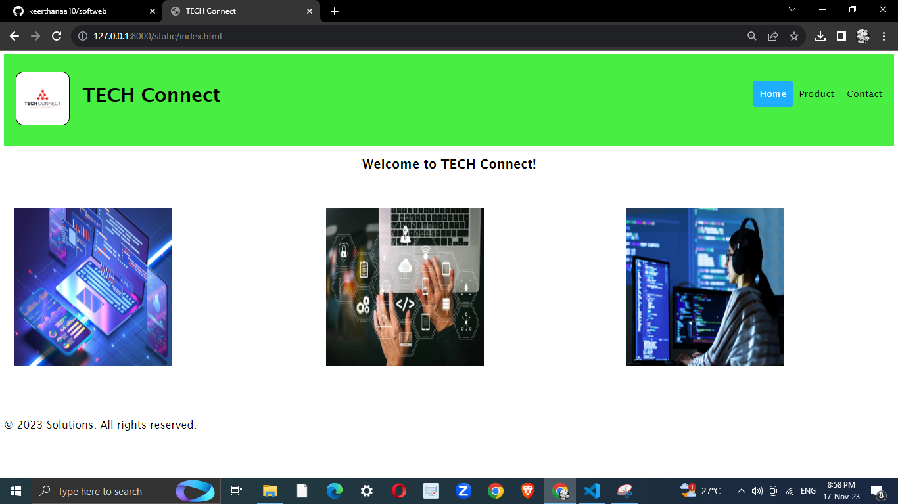
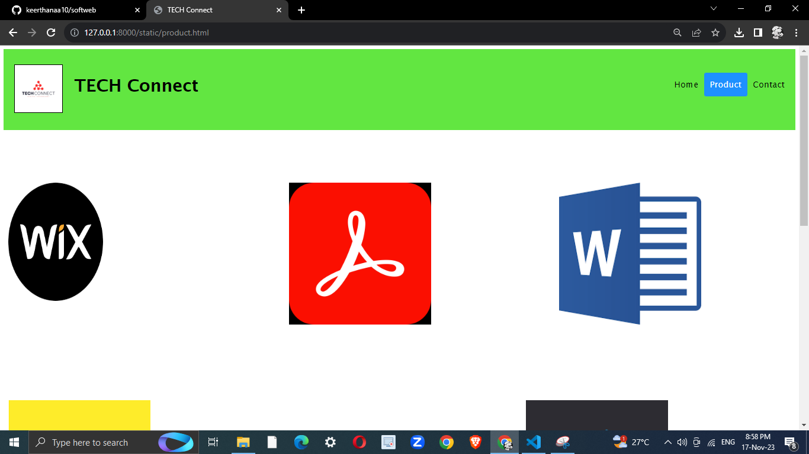
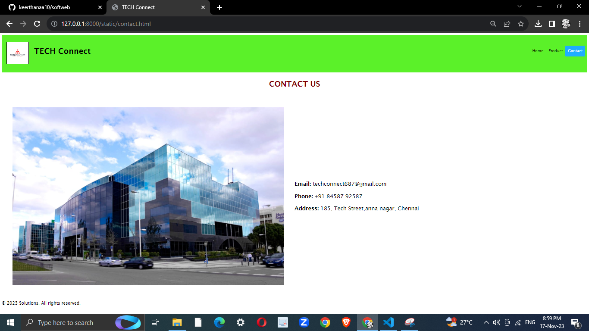
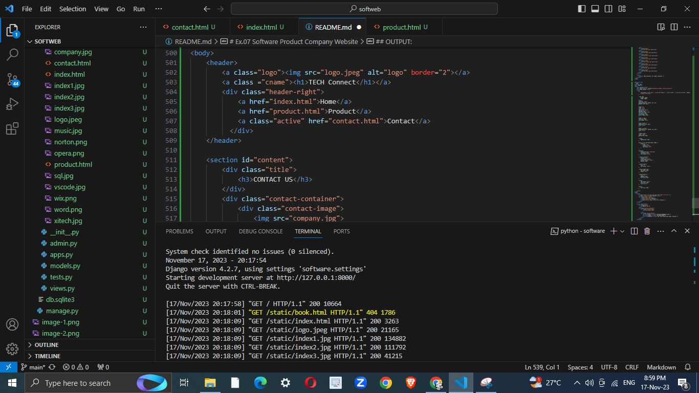

# Ex.07 Software Product Company Website
### Date : 31-10-2023
## AIM:
To develop a static company website to display the softwares and services provided by the company.

## DESIGN STEPS:

### Step 1:
Requirement collection.

### Step 2:
Creating the layout using HTML and CSS.

### Step 3:
Updating the sample content.

### Step 4:
Choose the appropriate style and color scheme.

### Step 5:
Validate the layout in various browsers.

### Step 6:
Validate the HTML code.

### Step 7:
Publish the website in the given URL.

## PROGRAM:
### index.html
```html
<!DOCTYPE html>
<html lang="en">
<head>
    <meta charset="UTF-8">
    <meta name="viewport" content="width=device-width, initial-scale=1.0">
    <title>TECH Connect</title>
    <style>
        *{
            font-family:'Lucida Sans', 'Lucida Sans Regular', 'Lucida Grande', 'Lucida Sans Unicode', Geneva, Verdana, sans-serif;
            
        }
        img{
            border-radius: 15px;
        }
        .logo img{
            height: 100px;
            width: 100px;
        }
        header {
        overflow: hidden;
        background-color:rgb(72, 238, 66);
        padding: 20px 10px;
        }

        header a {
        float: left;
        color: black;
        text-align: center;
        padding: 12px;

        text-decoration: none;
        font-size: 18px; 
        line-height: 25px;
        border-radius: 4px;
        }

        header a.logo {
        font-size: 25px;
        font-weight: bold;
        }

        header a:hover {
        background-color: #ddd;
        color: black;
        }

        header a.active {
        background-color: rgb(30, 173, 255);
        color: white;
        }

        .header-right {
        float: right;
        padding-top: 30px;
        }

        .cname{
            padding-top: 20px;
        }

        @media screen and (max-width: 500px) {
            header a {
                float: none;
                display: block;
                text-align: left;
            }
        }

        #content{
            background-color:rgb(255, 255, 255);
            height: 500px;        
            overflow: hidden;
            line-height: 30px;
        }

        h1,h2{
            text-align: center;
        }

        .image1 img{
            padding: 20px;
            height: 300px;
            width: 300px;
            position:absolute;
            top: 280px;
            border-radius: 10px;
        }

        .image3 img{
            padding: 20px;
            height: 300px;
            width: 300px;
            position:absolute;
            top: 280px;
            left: 600px;
            border-radius: 10px;
        }

        .image2  img{
            padding: 20px;
            height: 300px;
            width: 300px;
            position:absolute;
            top: 280px;
            left: 1170px;
            border-radius: 10px;
        }

        footer{
            font-size: 20px;
        }

    </style>
</head>
<body>
    <header>
        <div class="logo">
            <a></a>
        </div>
        <a class ="cname"><h1>TECH Connect</h1></a>
        <div class="header-right">
            <a class="active" href="index.html">Home</a>
            <a href="product.html">Product</a>
            <a href="contact.html">Contact</a>
          </div>
    </header>

    <section id="content">
        <h1>Welcome to TECH Connect!
        </h1>
        
        <div class="image1">
            
        </div>
        <div class="image2">
            
        </div>
        <div class="image3">
            
        </div>
    </section>

    <footer>
        <p>&copy; 2023 Solutions. All rights reserved.</p>
    </footer>
</body>
</html>
```

### product.html
```html
<!DOCTYPE html>
<html lang="en">
<head>
    <meta charset="UTF-8">
    <meta name="viewport" content="width=device-width, initial-scale=1.0">
    <title>TECH Connect</title>
    <style>
        *{
            font-family:'Lucida Sans', 'Lucida Sans Regular', 'Lucida Grande', 'Lucida Sans Unicode', Geneva, Verdana, sans-serif;
        }

        .logo img{
            height: 100px;
            width: 100px;
        }
        header {
        overflow: hidden;
        background-color:rgb(98, 230, 65);
        padding: 20px 10px;
        }

        header a {
        float: left;
        color: black;
        text-align: center;
        padding: 12px;
        text-decoration: none;
        font-size: 18px; 
        line-height: 25px;
        border-radius: 4px;
        }

        header a.logo {
        font-size: 25px;
        font-weight: bold;
        }

        header a:hover {
        background-color: #ddd;
        color: black;
        }

        header a.active {
        background-color: dodgerblue;
        color: white;
        }

        .header-right {
        float: right;
        padding-top: 30px;
        }

        .cname{
            padding-top: 20px;
        }

        @media screen and (max-width: 500px) {
            header a {
                float: none;
                display: block;
                text-align: left;
            }
        }

        #content{
            background-color: white;
            height: 1500px;        
            overflow: hidden;
            line-height: 30px;
        }
        
        .prod1 img{
            padding: 10px;
            height: 250px;
            width: 200px;
            position:absolute;
            top: 280px;
        }

        .prod2 img{
            padding: 10px;
            height: 300px;
            width: 300px;
            position:absolute;
            top: 280px;
            left: 1170px;
        }

        .prod3 img{
            padding: 10px;
            height: 300px;
            width: 300px;
            position:absolute;
            top: 280px;
            left: 600px;
        }

        .prod4 img{
            padding: 10px;
            height: 300px;
            width: 300px;
            position:absolute;
            top: 740px;
        }

        .prod5 img{
            padding: 10px;
            height: 300px;
            width: 300px;
            position:absolute;
            top: 740px;
            left: 650px;
        }

        .prod6 img{
            padding: 10px;
            height: 300px;
            width: 300px;
            position:absolute;
            top: 740px;
            left: 1100px;
        }

        .prod7 img{
            padding: 10px;
            height: 300px;
            width: 300px;
            position:absolute;
            top: 1140px;
        }

        .prod8 img{
            padding: 10px;
            height: 300px;
            width: 300px;
            position:absolute;
            top: 1140px;
            left: 1170px;
        }

        .prod9 img{
            padding: 10px;
            height: 300px;
            width: 300px;
            position:absolute;
            top: 1140px;
            left: 650px;
        }

        .quote{
            text-align: center;
            font-size: 20px;
            color:aquamarine ;
        }

        footer{
            font-size: 20px;
        }

    </style>
</head>
<body>
    <header>
        <a class="logo"></a>
        <a class ="cname"><h1>TECH Connect</h1></a>
        <div class="header-right">
            <a href="index.html">Home</a>
            <a class="active" href="product.html">Product</a>
            <a href="contact.html">Contact</a>
          </div>
    </header>

    <section id="content">

        <div class="prod1">
            
        </div>
        <div class="prod2">
            
        </div>
        <div class="prod3">
            
        </div>
        <div class="prod4">
            
        </div>
        <div class="prod5">
            
        </div>
        <div class="prod6">
            
        </div>
        <div class="prod7">
            
        </div>
        <div class="prod8">
            
        </div>
        <div class="prod9">
            
        </div>
    </section>

    <footer>
        <p>&copy; 2023 Solutions. All rights reserved.</p>
    </footer>
</body>
</html>
```

### contact.html
```html
<!DOCTYPE html>
<html lang="en">
<head>
    <meta charset="UTF-8">
    <meta name="viewport" content="width=device-width, initial-scale=1.0">
    <title>TECH Connect</title>
    <style>
        *{
            font-family:'Lucida Sans', 'Lucida Sans Regular', 'Lucida Grande', 'Lucida Sans Unicode', Geneva, Verdana, sans-serif;
        }

        .logo img{
            height: 100px;
            width: 100px;
        }
        header {
        overflow: hidden;
        background-color: rgb(91, 241, 41);
        padding: 20px 10px;
        }

        header a {
        float: left;
        color: black;
        text-align: center;
        padding: 12px;
        text-decoration: none;
        font-size: 18px; 
        line-height: 25px;
        border-radius: 4px;
        }

        header a.logo {
        font-size: 25px;
        font-weight: bold;
        }

        header a:hover {
        background-color: #ddd;
        color: black;
        }

        header a.active {
        background-color: rgb(30, 173, 255);
        color: white;
        }

        .header-right {
        float: right;
        padding-top: 30px;
        }

        .cname{
            padding-top: 20px;
        }

        @media screen and (max-width: 500px) {
            header a {
                float: none;
                display: block;
                text-align: left;
            }
        }

        #content{
            background-color: #ffffff96;
            overflow: hidden;
            line-height:normal;
        }
        
        .contact-container {
            display: flex;
            align-items: center;
            justify-content: center;
            padding: 50px;
        }

        .contact-image {
            flex: 1;
            text-align: center;
        }

        .contact-image img {
            max-width: 100%;
            height: auto;
        }

        .contact-details {
            flex: 1;
            padding: 50px;
            font-size: 25px;
        }

        .title{
            text-align: center;
            font-size: 30px;
            color:maroon;
        }

        footer{
            font-size: 20px;
        }

    </style>
</head>
<body>
    <header>
        <a class="logo"></a>
        <a class ="cname"><h1>TECH Connect</h1></a>
        <div class="header-right">
            <a href="index.html">Home</a>
            <a href="product.html">Product</a>
            <a class="active" href="contact.html">Contact</a>
          </div>
    </header>

    <section id="content">
        <div class="title">
            <h3>CONTACT US</h3>
        </div>
        <div class="contact-container">
            <div class="contact-image">
                
              
            </div>
            <div class="contact-details">
                <p><strong>Email:</strong> techconnect687@gmail.com</p>
                <p><strong>Phone:</strong> +91 84587 92587</p>
                <p><strong>Address:</strong> 185, Tech Street,anna nagar, Chennai</p>
            </div>
        </div>
    </section>

    <footer>
        <p>&copy; 2023 Solutions. All rights reserved.</p>
        </footer>
</body>
</html>

```
## OUTPUT:






## RESULT:
The program for designing software company website using HTML and CSS is completed successfully.
